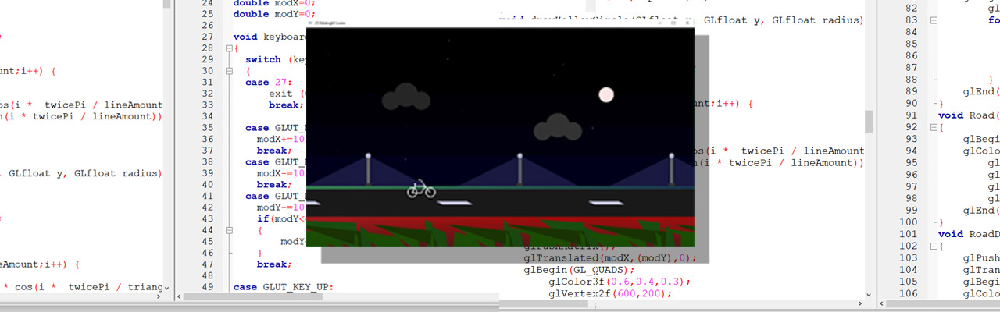

# 2D Midnight Environment Scene with Bicycle

## Overview

This project is a **Computer Graphics (OpenGL/GLUT)** application that renders a **2D animated midnight roadside environment** featuring a bicycle and various environmental elements. The scene simulates a nighttime atmosphere through animated clouds, stars, moonlight, lamp posts, grass, roads, and a bicycle object.

The project was developed using the **OpenGL Fixed Function Pipeline** and **GLUT** for rendering, animation, and user interaction.

---

## Project Contributors

### Environment Scene

* **Sudipto Majumder**
* ID: 143400005

### Bicycle Object

* **Merina Kawsar**
* ID: 143400003

---
### Screenshot
<p align="center">
  
</p>
---

## Features

### Environment Elements

* Animated midnight sky
* Moon and north star
* Dynamic stars
* Moving clouds
* Grass fields
* Land and roadside scenery
* Road with animated dividers
* Lamp posts with lighting effects

### Bicycle Model

* Two bicycle wheels
* Bicycle frame
* Handlebar
* Seat structure

### User Interaction

* Move bicycle horizontally using arrow keys
* Move bicycle vertically within predefined limits

### Animation

* Continuous environmental scrolling
* Moving clouds
* Moving moon and stars
* Animated road dividers
* Animated lamp posts and grass

---

## Technologies Used

* C/C++
* OpenGL
* GLUT (OpenGL Utility Toolkit)
* Windows API

### Libraries

```cpp
#include <windows.h>
#include <GL/glut.h>
#include <GL/gl.h>
#include <GL/glu.h>
#include <math.h>
#include <stdlib.h>
```

---

## Project Architecture

| Module              | Functions                                                  |
| ------------------- | ---------------------------------------------------------- |
| Initialization      | `main()`, `Init()`                                         |
| Input Handling      | `keyboard()`                                               |
| Animation           | `update()`                                                 |
| Primitive Drawing   | `drawFilledCircle()`, `drawHollowCircle()`, `cyclewheel()` |
| Environment Objects | `Moon()`, `Cloud()`, `Grass()`, `Land()`, `Road()`         |
| Infrastructure      | `LampPost()`, `LampLighting()`, `RoadDivider()`            |
| Bicycle Model       | `drawBicycle()`, `rotateWheel()`, `BicycleModifier()`      |
| Rendering           | `display()`                                                |

---

## Controls

| Key         | Action                |
| ----------- | --------------------- |
| Right Arrow | Move bicycle right    |
| Left Arrow  | Move bicycle left     |
| Up Arrow    | Move bicycle upward   |
| Down Arrow  | Move bicycle downward |

### Note

The Escape key exit functionality exists in the source code but is not active because the program uses:

```cpp
glutSpecialFunc(keyboard);
```

instead of a standard keyboard callback.

---

## Animation System

The animation is controlled by a global variable:

```cpp
double Angle;
```

The timer updates every 20 milliseconds:

```cpp
glutTimerFunc(20, update, 0);
```

Approximate refresh rate:

```text
1000 / 20 = 50 FPS
```

### Scrolling Effect

The illusion of movement is achieved by translating scene objects using:

```cpp
-(Angle * speed)
```

This creates the impression that the bicycle is moving while the environment scrolls backward.

---

## Scene Components

### Moon

* Rendered using a filled circle
* Moves slowly across the sky

### North Star

* Small bright star
* Slow movement creates depth

### Clouds

* Constructed using overlapping circles
* Move continuously across the scene

### Dynamic Stars

* Randomly generated stars rendered every frame

### Land

* Uses color gradients for a realistic ground appearance

### Road

* Dark horizontal road section

### Road Dividers

* Animated white road markings

### Lamp Posts

* Vertical poles with illuminated bulbs
* Repeated across the roadside

### Grass

* Procedurally generated using randomized vertices

---

## Mathematical Concepts

### Circle Generation

The project uses parametric equations to generate circles:

```text
x = r cos(θ)
y = r sin(θ)
```

Used in:

* `drawFilledCircle()`
* `drawHollowCircle()`
* `cyclewheel()`

### Object Translation

Scene movement is implemented through:

```text
x' = x - (Angle × speed)
```

---

## Performance Analysis

### Strengths

* Lightweight rendering
* Simple geometry
* Low memory consumption
* Suitable for educational purposes
* Easy-to-understand architecture

### Limitations

#### Random Object Flickering

Functions such as:

```cpp
dynamicStars();
Grass();
```

generate random positions every frame using:

```cpp
rand();
```

Result:

* Flickering stars
* Changing grass shapes

#### Off-Screen Rendering

Large loops render many objects outside the visible area:

```cpp
for(int x=0; x<15000; x+=250)
```

This causes unnecessary rendering overhead.

---

## Known Issues

### Wheel Rotation Not Implemented

The function:

```cpp
rotateWheel();
```

exists but is never called.

Current behavior:

* Bicycle remains stationary
* Wheels do not rotate

### Building Not Rendered

The building function exists but is disabled:

```cpp
// BuildingSmall();
```

### Unused Variables

```cpp
float red;
float green;
float blue;
int radius;
```

These variables are declared but never used.

### Escape Key Does Not Work

The ESC key handling is implemented incorrectly for a GLUT special-key callback.

---

## Recommended Improvements

### Functional Improvements

* Implement rotating bicycle wheels
* Enable the building object
* Add rider animation
* Introduce day/night transitions
* Add traffic or additional moving objects

### Performance Improvements

* Pre-generate stars instead of using random values every frame
* Cache grass geometry
* Render only visible objects
* Reduce unnecessary draw calls

### Visual Improvements

* Enable OpenGL blending:

```cpp
glEnable(GL_BLEND);
glBlendFunc(GL_SRC_ALPHA, GL_ONE_MINUS_SRC_ALPHA);
```

* Use alpha transparency for lamp lighting
* Add gradients and atmospheric effects
* Improve moon and cloud shading

### Code Improvements

* Remove unused variables
* Remove dead code
* Replace magic numbers with constants

Example:

```cpp
#define WINDOW_WIDTH 1280
#define WINDOW_HEIGHT 720
```

---

## OpenGL Assessment

This project uses legacy OpenGL immediate-mode rendering:

```cpp
glBegin(...)
glVertex(...)
glColor(...)
glEnd(...)
```

While deprecated in modern OpenGL, this approach is appropriate for educational computer graphics projects because it clearly demonstrates:

* Coordinate systems
* Transformations
* Primitive drawing
* Animation concepts

---

## Evaluation

| Category            | Score |
| ------------------- | ----- |
| Scene Design        | 8/10  |
| Animation           | 8/10  |
| Object Modeling     | 7/10  |
| User Interaction    | 6/10  |
| Code Structure      | 8/10  |
| Performance         | 6/10  |
| Modern OpenGL Usage | 3/10  |

### Overall Score

**7.3 / 10**

---

## Conclusion

This project successfully demonstrates the fundamentals of 2D computer graphics using OpenGL and GLUT. It combines animation, geometric modeling, transformations, and user interaction to create an engaging midnight roadside environment. Although there are areas for optimization and enhancement, the project serves as an excellent educational example of scene composition and animation using legacy OpenGL.
